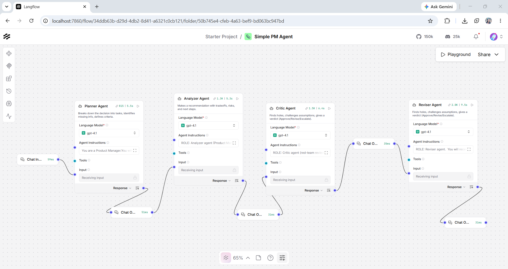
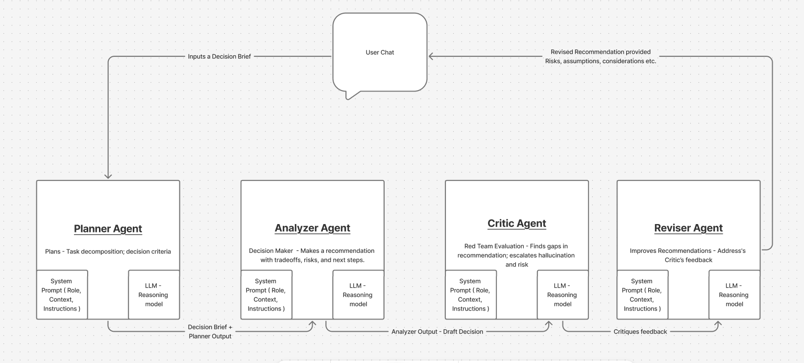

# PM-Assistant---Feature-Prioritization-Workflow
This is a simple multi agent workflow that is built to help Product Managers (PM) to prioritize products features that are requested by the customer, considering resource and time constraints.

# Problem Statement :
A Product Manager at a B2B SaaS company faces a prioritization challenge. Customers have requested five new features, but the team only has capacity to deliver two within the upcoming quarter. The requested features include:

Dark Mode (200 requests, 2 weeks)

PDF Export (50 enterprise requests, 4 weeks)

Mobile App (500 requests, 12 weeks)

SSO Integration (30 requests, $150K deals blocked)

Dashboard Redesign (100 requests, 4 weeks)

The constraints are clear: only two engineers are available, the quarter spans 10 weeks, and at least one customer‑visible improvement must be shipped.

# Objective 
The goal is to build a multi‑agent LangFlow pipeline that assists product managers in prioritizing features for the next quarter. This pipeline demonstrates the core multi‑agent pattern: specialized agents working together, each with a single responsibility — such as analyzing customer demand, evaluating revenue impact, estimating effort, and ensuring visibility.

# Solution
We Will Use the below agents on langflow platform , each of them performing specific tasks using system prompts and Open AI LLM model.

**Planner Agent** - Breaks down the decision into tasks, identifies missing info, defines criteria. Does NOT recommend. 
**Analyzer Agent** - Makes a recommendation with tradeoffs, risks, and next steps. 
**Critic Agent** - Finds holes, challenges assumptions, gives a verdict( Approve / Revise/ Escalate )
**Reviser Agent** - Reviser fixes the memo using critique, provide Clearer mitigations + stronger next steps.

# System Design

# Setup Instructions

# Scaling_Stragey
Full implementation templates and production scaling strategies are maintained in a private repository; access for technical review is available upon request
